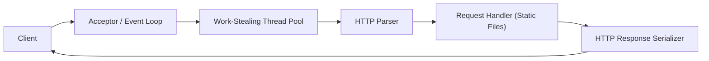

# Multithreaded HTTP Server in C++17

A production-style HTTP/1.1 static file server built from scratch using POSIX sockets, modern C++ concurrency primitives, and a work-stealing thread pool.

## Highlights

- HTTP/1.1 request parsing with partial read handling
- Persistent connections (`keep-alive`) and pipelined request support
- RAII socket wrapper with robust POSIX error propagation (`errno` + `strerror`)
- Work-stealing thread pool (`owner pop` + `cross-thread steal`)
- Static file serving with directory traversal protection
- LRU file cache for frequently accessed assets
- Request safety limits:
  - Max header section: 8 KB
  - Max URI length: 2048 bytes
  - Max body size: 10 MB
  - Connection idle timeout: 60 seconds
  - Per-IP connection cap: 100
- Thread-safe logging with timestamped output
- Unit tests using Google Test

## Architecture



## Repository Structure

```text
http-server/
├── CMakeLists.txt
├── README.md
├── src/
│   ├── main.cpp
│   ├── server/        # Socket, Acceptor, HttpServer
│   ├── threadpool/    # ThreadPool, WorkStealingQueue, Task
│   ├── http/          # Request/Response/Parser/Constants
│   ├── handlers/      # Request, File, Error handlers
│   └── utils/         # Logger, FileCache
├── tests/
│   ├── test_parser.cpp
│   ├── test_threadpool.cpp
│   └── test_server.cpp
└── public/
    └── index.html
```

## Build

### Prerequisites

- C++17-compatible compiler (`clang++` or `g++`)
- CMake `>= 3.14`
- POSIX-compatible OS (Linux/macOS)
- Google Test (for tests)

### Compile

```bash
mkdir -p build
cd build
cmake -DCMAKE_BUILD_TYPE=Release ..
cmake --build . -j
```

## Run

### Thread-pool mode

```bash
./http-server --port 8080 --threads 8 --root ../public
```

### kqueue mode (macOS/BSD)

```bash
./http-server --port 8080 --threads 8 --root ../public --kqueue
```

### Command-line options

- `--port <num>`: server port (default `8080`)
- `--threads <num>`: worker threads (default `hardware_concurrency`)
- `--root <path>`: document root (default `./public`)
- `--kqueue`: use event-loop mode on macOS/BSD

## Test

```bash
cd build
cmake -DBUILD_TESTS=ON ..
cmake --build . -j
ctest --output-on-failure
```

## Benchmark

### ApacheBench examples

```bash
ab -n 100000 -c 100 http://127.0.0.1:8080/index.html
ab -n 100000 -c 1000 -k http://127.0.0.1:8080/index.html
```

### Pipelining sanity check

```bash
printf 'GET /index.html HTTP/1.1\r\nHost: localhost\r\nConnection: keep-alive\r\n\r\nGET /index.html HTTP/1.1\r\nHost: localhost\r\nConnection: close\r\n\r\n' | nc 127.0.0.1 8080
```

### Example local results

For `/index.html` (~644 bytes), keep-alive enabled:

| Concurrency | Requests | Req/sec (mean) | Mean latency | Max latency |
|---|---:|---:|---:|---:|
| 100 | 100000 | 25473.22 | 3.926 ms | 5 ms |
| 500 | 100000 | 25515.46 | 19.596 ms | 25 ms |
| 1000 | 100000 | 25277.34 | 39.561 ms | 49 ms |

## Security and Robustness

- Path traversal prevention (`..` rejection + canonical path checks)
- Static files constrained to configured document root
- Max file size served: `10 MB`
- Graceful handling for malformed requests (`400`)
- Connection and parsing limits to prevent unbounded memory growth

## Logging

```text
[2026-02-13 14:30:45] GET /index.html 200
```

## Troubleshooting

### `socket: Too many open files (24)`

```bash
ulimit -n 20000
```

### Port already in use

```bash
./http-server --port 9090 --threads 8 --root ../public
```

## License

Add your preferred license in `LICENSE` (e.g., MIT, Apache-2.0).
